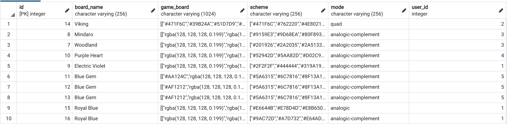
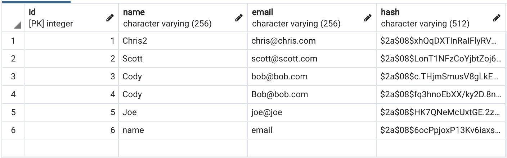

     ___      ___        ___________      ____________         ______       ____    ____________
    /***\    /***\      /************\   /************\       /******\      |**|   |***********/
   /**/\*\  /*/\**\     |**|      |**|  |***/___________     /***/\***\     |**|   |**|
  /**/  \*\/*/  \**\    |**|      |**|  | *************|    /***/__\***\    |**|   |**|
 /**/    \**/    \**\   |**|______|**|   ___________/**|   /**________**\   |**|   |**|__________
/**/              \**\   \**********/   /*************/   /**/        \**\  |**|   |************/


# Things to come. Future Features.
‾‾‾‾‾‾‾‾‾‾‾‾‾‾‾‾‾‾‾‾‾‾‾‾‾‾‾‾‾‾‾‾‾‾
[x]loading spinners
  [x]loading board
  [x]deleteing userboards
  [x]saving boards
  [x]login
[]try/catches on all calls
  [x]login/signin
  [x]saving
  [x]deleting
  [x]get boards
  [x]switch color pallete
  [x]get random color
[]change catch errors to onscreen messages
  []login/signin
  []saving
  []deleting
  []get boards
  []switch color pallete
  []get random color
[]refactor code and clean up
[]landscape or lock landscape
[]clean up README.md
[]rename files
[]reorganize layout
[]fade in title
[]picture on landing page and/or logo
[]more options for music
[]remove black, white, gray, (and super dark/light color?)
[]name it your saved board (overrideable name)

*stretch* ability to share; share something that's playable
*stretch* spinner on individual delete icon

### To Play, click: https://the-mosaic.herokuapp.com/ and wait for the game to load. Once you see the word Mosaic. You're good.

## Brought to you by the creative minds of Chris Ficht, Scott Harlan, Joe Goodman (v1.0.0), and Cody Brown with less than a year combined under their belts. 

### Problem Domain: In a world where stress and anxiety are all too common we bring you a way to relax. There are no points to worry about, no microtransactions to be bought, nor will your data be harvested. Just sit back and relax.
### Problem Domain: Stress in a stressful world! Don't you just wanna set aside your worries and take the edge off modern life?? Well there are drugs for that...but in the meantime there is ... Mosaic :)

### Mosaic is a free to play mosaic creator with a bit of a musical twist. Once the game loads you start off by choosing your starting color palette; you can switch colors by clicking on 'switch color'. Once you have the desired color click 'play'. Once you click play you are presented with a game-board, the word mosaic, and a variety of settings.
### Game-board: The game-board consists of a number of triangles. Click on one and it both changes colors, and plays a note which can be played back later. From here you can create your very own mosaic. Some of the more popular things to create are giants, foxes, hearts, boats, and more.
### The Word Mosaic: The word mosaic at the top displays your current color palette. To change the color palette go into settings.
### Settings: There are 3 main settings: User, Color, and Music. In user settings you can create and sign into an existing user as well as go to your existing saved game-boards. In Color you can change the palette you're working with, view the name of your mosaic, as well as save your mosaic for a later date. In music you can mute the app or playback your mosaic at a variety of speeds. 


### Version 1.2.1 

### Front End Dependencies: 
```
{
    "@material-ui/core": "^4.9.5",
    "@material-ui/icons": "^4.9.1",
    "@testing-library/jest-dom": "^4.2.4",
    "@testing-library/react": "^9.4.1",
    "@testing-library/user-event": "^7.2.1",
    "enzyme": "^3.11.0",
    "enzyme-adapter-react-16": "^1.15.2",
    "react": "^16.13.0",
    "react-dom": "^16.13.0",
    "react-router-dom": "^5.1.2",
    "react-scripts": "3.4.0",
    "react-test-renderer": "^16.13.0",
    "superagent": "^5.2.2"
  },
```
### Back End Dependencies:
```
{
    "bcryptjs": "^2.4.3",
    "cors": "^2.8.5",
    "dotenv": "^8.2.0",
    "express": "^4.17.1",
    "jest": "^25.1.0",
    "jsonwebtoken": "^8.5.1",
    "morgan": "^1.9.1",
    "pg": "^7.12.1",
    "string-hash": "^1.1.3",
    "superagent": "^5.1.0",
    "supertest": "^4.0.2"
  },
```

### API Endpoints: 
```
    export async function getRandomColor() {
        const generateHex = Math.floor(Math.random()*16777215).toString(16);
        return await request.get(`https://www.thecolorapi.com/id?hex=${generateHex}`);
    }
    export async function getScheme(hex, mode) {
      const cleanHex = hex.slice(1)
      const schemeData = await request.get(`https://www.thecolorapi.com/scheme?hex=${cleanHex}&mode=${mode}&count=6`);
      return schemeData.body.colors.map(color => color.hex.value)
    }
```

### BackEnd Endpoints:
```
const URL = 'https://mosaic-node-db.herokuapp.com/api'

    export async function signin(user) {
      return await request.post(`${URL}/auth/signin`, user)
    }
    export async function signup(user) {
      return await request.post(`${URL}/auth/signup`, user)
    }
    export async function saveBoard(stateObject, user) {
      return await request.post(`${URL}/user/saved`, stateObject).set('Authorization', user.token)
    }
    export async function updateBoard(stateObject, user, id) {
      return await request.put(`${URL}/user/saved/${id}`, stateObject).set('Authorization', user.token)
    }
    export async function getBoards(user) {
      return await request.get(`${URL}/user/saved`).set('Authorization', userCheck.token)
    }
    export async function deleteBoard(id, user) {
      return await request.delete(`${URL}/user/saved/${id}`).set('Authorization', user.token)
    }
```

### Boards Database structure


### Users Database structure


## MIT License
### Copyright 2020 The Mosaic

##### Permission is hereby granted, free of charge, to any person obtaining a copy of this software and associated documentation files (the "Software"), to deal in the Software without restriction, including without limitation the rights to use, copy, modify, merge, publish, distribute, sublicense, and/or sell copies of the Software, and to permit persons to whom the Software is furnished to do so, subject to the following conditions:

##### The above copyright notice and this permission notice shall be included in all copies or substantial portions of the Software.

##### THE SOFTWARE IS PROVIDED "AS IS", WITHOUT WARRANTY OF ANY KIND, EXPRESS OR IMPLIED, INCLUDING BUT NOT LIMITED TO THE WARRANTIES OF MERCHANTABILITY, FITNESS FOR A PARTICULAR PURPOSE AND NONINFRINGEMENT. IN NO EVENT SHALL THE AUTHORS OR COPYRIGHT HOLDERS BE LIABLE FOR ANY CLAIM, DAMAGES OR OTHER LIABILITY, WHETHER IN AN ACTION OF CONTRACT, TORT OR OTHERWISE, ARISING FROM, OUT OF OR IN CONNECTION WITH THE SOFTWARE OR THE USE OR OTHER DEALINGS IN THE SOFTWARE.


